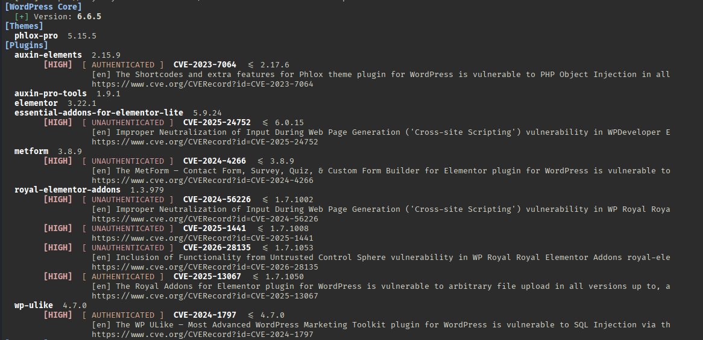

# CMScan



**CMScan** is a unified security scanner for WordPress, Drupal, Joomla, PrestaShop, Shopify, Magento, TYPO3, and OpenCart websites. 

**No api-key, no limitation**   
It detects CMS versions, enumerates users, checks for known vulnerabilities, and exports the results to CSV.

## Features

- ✅ Vulnerability checking through:
    - [wpvulnerability.net](https://www.wpvulnerability.net/)
    - [OSV.dev](https://osv.dev/)
    - [FriendsOfPHP Security Advisories](https://github.com/FriendsOfPHP/security-advisories)
    - [NVD API](https://nvd.nist.gov/developers/vulnerabilities)
- ✅ Detection of sensitive files and paths (wp-config, .git, .env, etc.)
- ✅ Security header auditing (HSTS, CSP, X-Frame-Options, etc.)
- ✅ Comprehensive CSV export
- ✅ `--host` mode support for shared hosting environments
- ✅ Automatic 403 bypass using User-Agent rotation

## Installation

### Using the installer (recommended)

```bash
git clone https://github.com/moloch54/CMScan
cd CMScan
chmod +x install.sh
./install.sh
```

## Usage

```bash
python3 CMScan.py -L target.com  
```

